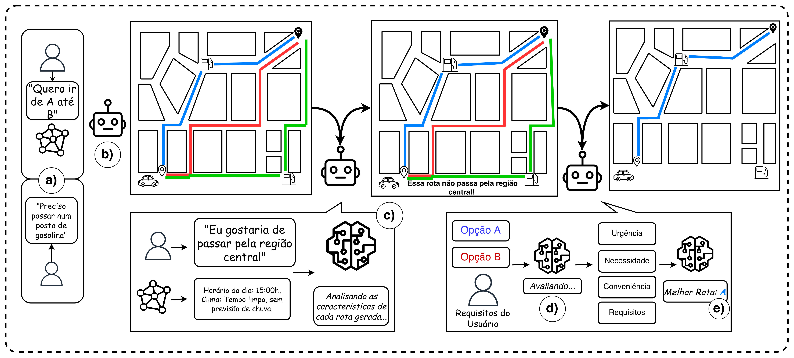

# Agente VAMOS! Planejamento de Rotas Veiculares Cientes de Contexto Semântico com Agentes de LLM

**Resumo do Artigo:** Sistemas de navegação tradicionais priorizam a eficiência métrica, como tempo ou distância, mas falham frequentemente na interpretação de intenções humanas complexas e dependentes do contexto. Embora os Grandes Modelos de Linguagem (LLMs) demonstrem potencial para preencher essa lacuna semântica, sua integração direta em Sistemas de Transporte Inteligentes (ITS) enfrenta barreiras críticas de escalabilidade, latência e dependência de conectividade. Para superar esses desafios, este trabalho apresenta o VAMOS (Vehicular Agent for Multi-objective Optimization and Semantics), um agente híbrido desenhado para operar eficientemente embarcado. O VAMOS desacopla o raciocínio semântico da otimização espacial, combinando Pequenos Modelos de Linguagem (SLMs) locais para a interpretação de intenções com algoritmos de grafos clássicos para a execução de rotas. A avaliação experimental em três cenários urbanos demonstra que o VAMOS atinge acurácia e completude superiores a 91% utilizando modelos compactos. Além disso, os resultados evidenciam um trade-off favorável: embora modelos massivos apresentem um ganho marginal de qualidade (~3%), o VAMOS oferece uma redução significativa no overhead computacional e de comunicação, validando a viabilidade de assistentes de navegação semanticamente conscientes.



# Estrutura do README

A documentação está estruturada para orientar o processo de avaliação, contendo:
1. Selos pretendidos.
2. Informações básicas de hardware e software.
3. Dependências do sistema.
4. Preocupações de segurança.
5. Instruções de instalação.
6. Teste mínimo de funcionalidade.
7. Guias de reprodução dos experimentos/reivindicações do artigo.
8. Licença.

A arquitetura do projeto reflete-se na seguinte estrutura de diretórios:
- `/src`: Módulos centrais (App, Motor de Roteamento, Agente LLM, Geo-Utils e Motor de Contexto).
- `/utils`: Ferramentas de benchmarking e geradores de cenários.
- `/mapas`: Saídas visuais das rotas geradas (e utilitários).
- `/docs`: Documentação técnica detalhada (arquivos, classes, APIs e dependências).
- `/graph_data`: (Gerado na execução) Cache e persistência das malhas viárias.
- `config.json`: Arquivo de configuração central (modelos, caminhos, parâmetros do benchmark).

Para documentação técnica detalhada (módulos, classes, funções, APIs e parâmetros), consulte [`docs/index.md`](docs/index.md).

# Selos Considerados

Os selos considerados para avaliação são: **Artefatos Disponíveis (SeloD)**, **Artefatos Funcionais (SeloF)**, **Artefatos Sustentáveis (SeloS)** e **Experimentos Reprodutíveis (SeloR)**.

# Informações básicas

O sistema foi concebido para execução local (borda/embarcado), visando minimizar a latência e a dependência de rede.
- **Sistema Operacional:** Linux (Ubuntu 20.04/22.04 LTS) ou macOS.
- **Hardware Mínimo:** Processador multi-core, 16 GB de RAM, 10 GB de armazenamento.
- **Hardware Recomendado:** Placa gráfica (GPU) com arquitetura NVIDIA (suporte a CUDA) e um mínimo de 8 GB de VRAM para a execução eficiente do modelo SLM (`Qwen3-4B`) sem offload para disco. Em macOS, o sistema utiliza automaticamente a GPU via MPS (Metal Performance Shaders).
- **Ambiente de Execução:** Python 3.10 ou superior (testado com 3.10 e 3.12). Python 3.13+ não é suportado pois alguns pacotes de dependência ainda não possuem wheels pré-compiladas para essas versões.

# Dependências

Para a execução deste artefato, requer-se a instalação dos seguintes componentes:
- **Sistema:** `git`, `curl`.
- **Bibliotecas Python principais (ver `requirements.txt`):** `osmnx` (grafos), `networkx` (algoritmos), `geopandas`/`pandas`, `matplotlib`, `outlines`, `ollama` e `transformers`.

*(Opcional)*: Chaves de API para OpenAI podem ser passadas via variável de ambiente `OPENAI_API_KEY`.

# Preocupações com segurança

A execução do artefato não apresenta riscos para o hardware do avaliador. O sistema efetua downloads pontuais das redes viárias através da API pública do OpenStreetMap, necessitando de acesso à internet na primeira execução de um cenário urbano inédito, assim como a obtenção dos modelos do próprio HuggingFace. Caso o avaliador utilize *tokens* de API pagos (ex: OpenAI) para testes avulsos, adverte-se para que não os adicione permanentemente ao código fonte para prevenir exposições acidentais em *commits*.

# Instalação

O processo de instalação configura o ambiente virtual e prepara o motor de inferência local.

**1.** Clone o repositório:
```bash
git clone https://github.com/carnotbraun/VAMOS
cd VAMOS
```

**2.** Configure o ambiente virtual e as dependências:
```bash
python3 -m venv env
source env/bin/activate
pip install -r requirements.txt
```

**3. (Necessário apenas para o método `--method ollama`)** Instale o serviço Ollama e transfira o modelo:
```bash
curl -fsSL https://ollama.com/install.sh | sh
ollama serve &
ollama pull qwen3:4b
```

> O método padrão é `--method hf` (HuggingFace), que não requer o Ollama. O passo 3 é necessário somente se você quiser usar `--method ollama`.

# Configuração

Todas as opções configuráveis estão no arquivo `config.json` na raiz do projeto. Não é necessário editar código-fonte para alterar modelos, cidade ou parâmetros do benchmark. Consulte [`docs/index.md`](docs/index.md#configuração-configjson) para a descrição completa de cada parâmetro.

Exemplo: para trocar a cidade, altere `routing.location` em `config.json`:
```json
{
  "routing": {
    "location": "São Paulo, Brazil"
  }
}
```

# Teste mínimo

O teste mínimo assegura que as bibliotecas espaciais, as projeções geográficas e a comunicação local com o modelo de linguagem estão devidamente configuradas.

**Procedimento:**  
No terminal, com o ambiente ativado, execute (método padrão: HuggingFace, sem necessidade do Ollama):

1. Utilizando coordenadas:
```bash
python3 src/app.py \
  --origin='-23.526038,-46.696681' \
  --destination='-23.520683,-46.679893' \
  --method hf \
  --tasks 'I need to go to a fuel'
```

> **Atenção:** Para coordenadas com valores negativos, use a sintaxe `--origin='-lat,-lon'` (com `=`). Caso contrário, o argparse pode interpretar o sinal negativo como início de uma nova flag.

2. Utilizando endereços textuais:
```bash
python3 src/app.py \
  --method hf \
  --origin "Avenida Paulista, São Paulo" \
  --destination "Parque Ibirapuera, São Paulo" \
  --tasks "preciso de combustivel urgente"
```

3. Utilizando o método Ollama (requer o passo 3 da instalação):
```bash
python3 src/app.py \
  --method ollama \
  --origin "Avenida Paulista, São Paulo" \
  --destination "Parque Ibirapuera, São Paulo" \
  --tasks "preciso de combustivel urgente"
```

**Opções adicionais:**
- `--output caminho/para/imagem.png` — define o caminho de saída do mapa da rota (padrão: `rota_final.png`).
- `--force-download` — força o re-download do grafo e dos POIs, ignorando o cache local.

**Resultado esperado:**  
O sistema fará o download do polígono viário do OpenStreetMap (pode demorar 3–4 minutos na primeira vez, ficando posteriormente em cache), dos POIs do cenário desejado (1–2 minutos) e, em seguida, carregará ou baixará o modelo de linguagem. O log exibirá o Agente identificando "combustível" como prioridade máxima (Importância 10), o motor de rotas resolverá o Problema do Caixeiro Viajante (TSP) para inserir um posto de abastecimento, e uma imagem `rota_final.png` será gerada destacando a trajetória ótima na raiz do projeto.

> **Nota sobre a primeira execução:** O modelo HuggingFace `Qwen/Qwen3-4B` (~8 GB) é baixado automaticamente do HuggingFace Hub na primeira execução. Execuções subsequentes carregam o modelo do cache local (significativamente mais rápido).

# Experimentos

Esta secção descreve os passos para a obtenção dos resultados cruciais apresentados no artigo.

**Nota:** O script de benchmark está configurado por padrão para reproduzir o dataset de São Paulo. Para avaliar Salvador ou Belém, altere o valor `routing.location` em `config.json` e execute o benchmark novamente. Os arquivos de cache do grafo anterior devem ser removidos ou use `--force-download`.

## Reivindicação #1: Alta Acurácia e Completude na Execução Local

O artigo argumenta (Tabela 2) que o modelo compacto `Qwen3-4B` processando localmente alcança mais de 91% de eficácia ao interpretar intenções humanas perante cenários topológicos e decidir sobre desvios semânticos (Urgência vs. Conveniência).

1. **Configuração:** Garanta que as dependências estão instaladas e o grafo da cidade esteja em cache (executando o teste mínimo previamente).

2. **Execução (método HF — padrão do artigo):**
```bash
python utils/bench.py
```

3. **Execução com método alternativo (Ollama):**
```bash
python utils/bench.py --method ollama
```

4. **Parâmetros disponíveis:**
```bash
python utils/bench.py --help
```
```
--method {hf,ollama,openai}  Backend de LLM (padrão: hf)
--runs N                     Repetições por cenário (padrão: 3)
--timeout T                  Timeout em segundos por execução (padrão: 900)
```

5. **Recursos e duração:** Dependendo da capacidade da GPU do avaliador, o teste completo consome entre 30 a 90 minutos. Serão utilizados ~4 GB de RAM para o grafo e ~5 GB de VRAM para a inferência do modelo.

6. **Resultado esperado:** O script gera o log completo e o arquivo sumário `benchmark_summary_report.txt`. Nas secções de "Cognitive Performance", os valores consolidados de *Precision* e *Completeness* corroborarão o padrão superior a 90% atestado no artigo.

## Reivindicação #2: Redução de Overhead de Comunicação (Estabilidade)

O artigo defende (Tabela 3) que a adoção de SLMs locais oferece um *overhead* fim-a-fim estável comparativamente a instâncias em nuvem.

1. **Execução:** Esta métrica é extraída como subproduto da execução da Reivindicação #1. Não há ação extra requerida.

2. **Resultado esperado:** Analisando os tempos na tabela "DETAIL BY CATEGORY" dentro de `benchmark_summary_report.txt`, observar-se-ão os valores de `Avg_Time`. Os tempos reportados atestarão estabilidade absoluta por iteração, operando os processos de geração, enriquecimento e avaliação puramente *offline*.

# LICENSE

Este projeto é distribuído sob a licença MIT. Para mais detalhes e permissões de replicação, consulte o ficheiro `LICENSE` na raiz do repositório.
